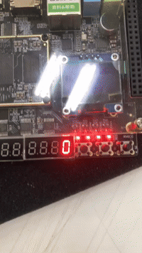

# Memory Game

This project is a digital memory game implemented on the Gowin FPGA using Verilog HDL. It features a state machine and a pseudo-random sequence generator (LFSR) to produce random sequences for the player to memorize and repeat, outputting the results to 7-segment displays.

## Demo

